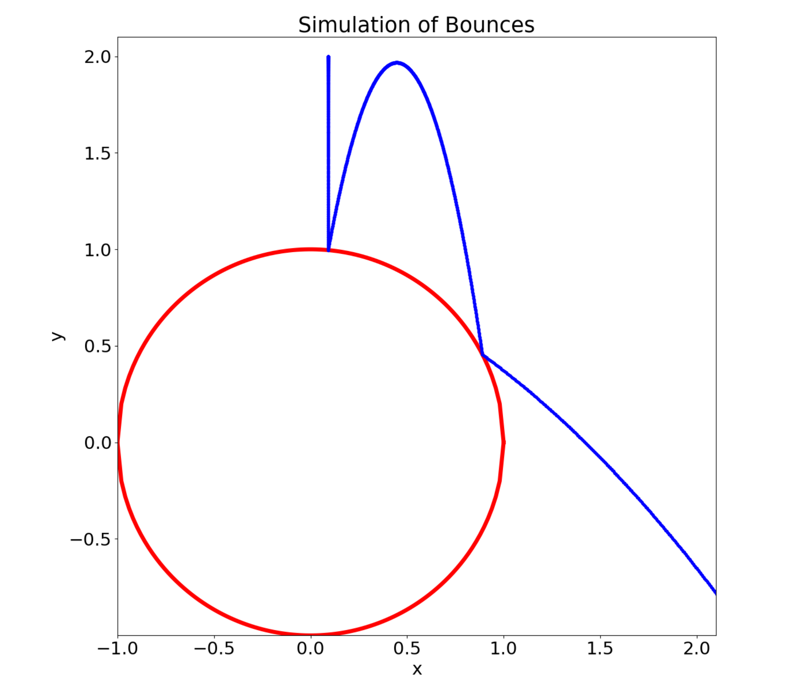

# Collision Sim

A simple physics simulator to model collisions between a moving ball and a large mass stationary object. Written in Python and includes options to change stationary object, provides information on the number of bounces that occur and comparison with approximate formulae derived quantitatively.

